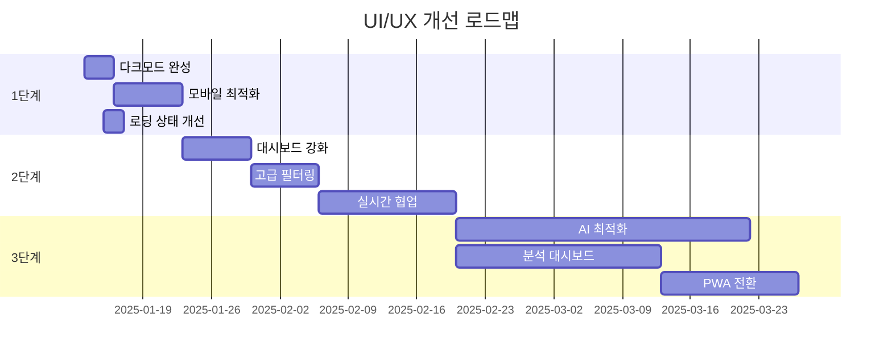

# ShiftEasy UI/UX 현황 분석 및 개선 계획

## 📊 현재 구현 현황

### ✅ 구현 완료된 주요 UI/UX 기능

#### 1. 페이지 구조
- **스케줄 관리** (`/schedule`)
  - 주간/월간 뷰 전환
  - 드래그 앤 드롭 근무표 편집
  - 실시간 통계 표시
  - 스케줄 생성 및 확정 기능
  
- **팀 관리** (`/team`)
  - 직원 목록 및 역할별 분류
  - 프리셋 저장/불러오기
  - 직원 추가/편집/삭제
  - 개인 선호도 설정

- **시스템 설정** (`/config`)
  - 근무 패턴 설정
  - 근무 규칙 구성
  - 고급 옵션 관리

#### 2. 디자인 시스템
- **색상 체계**
  - 근무 유형별 색상 코딩 (주간=파랑, 저녁=황색, 야간=남색, 휴무=회색)
  - 역할별 색상 구분 (RN=파랑, CN=보라, SN=초록, NA=황색)
  - 다크모드 지원 (부분적)

- **타이포그래피**
  - Inter 폰트 사용
  - 일관된 텍스트 계층 구조
  - 한국어 최적화

- **컴포넌트 라이브러리**
  - 재사용 가능한 UI 컴포넌트
  - 일관된 스타일링 (Tailwind CSS)
  - 반응형 디자인

#### 3. 사용자 경험 기능
- **상호작용**
  - 드래그 앤 드롭 (@dnd-kit)
  - 실시간 알림 (SSE)
  - 폼 유효성 검사
  - 로딩 상태 표시

- **접근성**
  - ARIA 레이블
  - 키보드 네비게이션
  - 포커스 상태 표시

## 🎯 개선 계획

### 1단계: 즉시 개선 가능한 항목 (1-2주)

#### 1.1 다크모드 완성
```typescript
// 구현 필요 사항:
- [ ] 다크모드 토글 버튼 추가
- [ ] 모든 컴포넌트에 다크모드 스타일 적용
- [ ] 시스템 설정 연동
- [ ] 사용자 선호도 저장
```

#### 1.2 모바일 최적화
```typescript
// 구현 필요 사항:
- [ ] 터치 제스처 개선 (스와이프, 핀치 줌)
- [ ] 반응형 네비게이션 메뉴
- [ ] 모바일 전용 뷰 모드
- [ ] 터치 타겟 크기 최적화 (최소 44px)
```

#### 1.3 로딩 상태 개선
```typescript
// 구현 필요 사항:
- [ ] 스켈레톤 스크린 구현
- [ ] 프로그레스 바 추가
- [ ] 낙관적 UI 업데이트
- [ ] 에러 복구 UI
```

### 2단계: 중기 개선 사항 (2-4주)

#### 2.1 대시보드 강화
```typescript
interface DashboardEnhancements {
  // 데이터 시각화
  charts: {
    shiftDistribution: "도넛 차트",
    weeklyTrends: "라인 차트",
    staffWorkload: "바 차트"
  },
  
  // 위젯 시스템
  widgets: {
    customizable: true,
    draggable: true,
    resizable: true
  },
  
  // 빠른 액션
  quickActions: [
    "즉시 근무 교대",
    "긴급 호출",
    "메시지 전송"
  ]
}
```

#### 2.2 고급 필터링 및 검색
```typescript
interface FilteringSystem {
  // 다중 필터
  filters: {
    byRole: boolean,
    bySkill: boolean,
    byAvailability: boolean,
    byExperience: boolean
  },
  
  // 스마트 검색
  search: {
    fuzzySearch: true,
    autoComplete: true,
    searchHistory: true
  },
  
  // 저장된 뷰
  savedViews: {
    custom: true,
    shared: true,
    default: true
  }
}
```

#### 2.3 실시간 협업 기능
```typescript
interface CollaborationFeatures {
  // 실시간 편집
  realTimeEdit: {
    cursorSharing: true,
    liveUpdates: true,
    conflictResolution: true
  },
  
  // 커뮤니케이션
  communication: {
    inAppChat: true,
    comments: true,
    mentions: true
  },
  
  // 활동 추적
  activityTracking: {
    changelog: true,
    userPresence: true,
    notifications: true
  }
}
```

### 3단계: 장기 개선 사항 (1-2개월)

#### 3.1 AI 기반 스케줄 최적화
```typescript
interface AIFeatures {
  // 스마트 제안
  suggestions: {
    optimalSchedule: true,
    conflictResolution: true,
    fairnessOptimization: true
  },
  
  // 예측 분석
  predictions: {
    absencePattern: true,
    workloadForecast: true,
    burnoutRisk: true
  },
  
  // 자동화
  automation: {
    autoScheduling: true,
    smartSwapping: true,
    emergencyCoverage: true
  }
}
```

#### 3.2 통합 분석 대시보드
```typescript
interface AnalyticsDashboard {
  // 성과 지표
  metrics: {
    efficiency: "실시간",
    satisfaction: "주간",
    compliance: "월간"
  },
  
  // 리포트
  reports: {
    customizable: true,
    exportable: true,
    scheduled: true
  },
  
  // 인사이트
  insights: {
    aiPowered: true,
    actionable: true,
    predictive: true
  }
}
```

#### 3.3 PWA (Progressive Web App) 전환
```typescript
interface PWAFeatures {
  // 오프라인 지원
  offline: {
    caching: true,
    sync: true,
    fallback: true
  },
  
  // 네이티브 기능
  native: {
    pushNotifications: true,
    homeScreen: true,
    shareTarget: true
  },
  
  // 성능
  performance: {
    lazyLoading: true,
    codeSpitting: true,
    preloading: true
  }
}
```

## 🚀 우선순위 매트릭스

| 개선 항목 | 영향도 | 난이도 | 우선순위 | 예상 기간 |
|---------|-------|-------|---------|----------|
| 다크모드 완성 | 높음 | 낮음 | 1 | 3일 |
| 모바일 최적화 | 높음 | 중간 | 2 | 1주 |
| 스켈레톤 스크린 | 중간 | 낮음 | 3 | 2일 |
| 대시보드 차트 | 높음 | 중간 | 4 | 1주 |
| 고급 필터링 | 중간 | 중간 | 5 | 1주 |
| 실시간 협업 | 높음 | 높음 | 6 | 2주 |
| AI 최적화 | 높음 | 높음 | 7 | 1개월 |
| PWA 전환 | 중간 | 높음 | 8 | 2주 |

## 💡 즉시 적용 가능한 Quick Wins

### 1. 마이크로 인터랙션 추가
```css
/* 호버 효과 개선 */
.card {
  transition: all 0.3s cubic-bezier(0.4, 0, 0.2, 1);
}

.card:hover {
  transform: translateY(-2px);
  box-shadow: 0 10px 20px rgba(0,0,0,0.1);
}

/* 클릭 피드백 */
.button:active {
  transform: scale(0.98);
}
```

### 2. 빈 상태 UI 개선
```tsx
const EmptyState = () => (
  <div className="text-center py-12">
    <Icon className="mx-auto h-12 w-12 text-gray-400" />
    <h3 className="mt-2 text-sm font-medium">데이터 없음</h3>
    <p className="mt-1 text-sm text-gray-500">
      시작하려면 새 항목을 추가하세요
    </p>
    <button className="mt-4 btn-primary">
      + 추가하기
    </button>
  </div>
);
```

### 3. 토스트 알림 시스템
```tsx
const Toast = ({ message, type }) => (
  <div className={`toast toast-${type}`}>
    <Icon />
    <span>{message}</span>
    <button onClick={dismiss}>×</button>
  </div>
);
```

### 4. 단축키 지원
```typescript
const shortcuts = {
  'cmd+s': 'save',
  'cmd+z': 'undo',
  'cmd+shift+z': 'redo',
  'cmd+k': 'search',
  'esc': 'close'
};
```

## 📈 성공 지표

### 정량적 지표
- **성능**: First Contentful Paint < 1.5s
- **접근성**: Lighthouse 점수 > 90
- **사용성**: Task Success Rate > 95%
- **만족도**: Net Promoter Score > 50

### 정성적 지표
- 사용자 피드백 긍정 비율
- 학습 곡선 단축
- 오류 발생률 감소
- 재사용률 증가

## 🔄 구현 로드맵



## 🎨 디자인 개선 예시

### Before & After 비교

#### 1. 스케줄 카드
**Before:**
- 단순 텍스트 표시
- 제한된 정보
- 평면적 디자인

**After:**
- 아이콘 추가
- 상태 인디케이터
- 그림자 효과
- 호버 애니메이션

#### 2. 네비게이션
**Before:**
- 텍스트만 표시
- 고정 위치
- 단일 레벨

**After:**
- 아이콘 + 텍스트
- 반응형 변환
- 브레드크럼 추가
- 활성 상태 표시

## 📝 다음 단계

1. **즉시 시작**: Quick Wins 항목부터 구현
2. **사용자 피드백**: 개선 사항에 대한 의견 수집
3. **A/B 테스트**: 주요 변경 사항 검증
4. **반복 개선**: 데이터 기반 최적화

이 계획을 통해 ShiftEasy는 더욱 직관적이고 효율적인 사용자 경험을 제공할 수 있을 것입니다.