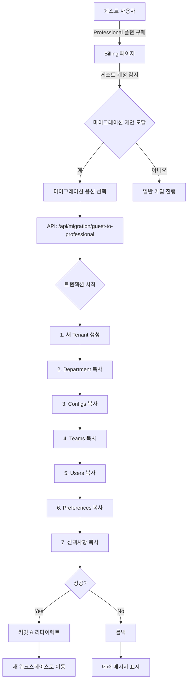

# 게스트 → Professional 플랜 마이그레이션 설계

## 📋 개요

게스트 계정으로 ShiftEasy를 체험한 사용자가 Professional 플랜으로 업그레이드할 때, 기존에 설정한 데이터를 새로운 워크스페이스로 원활하게 마이그레이션하는 기능입니다.

## 🎯 목표

1. **사용자 경험 향상**: 게스트 체험 → 유료 전환 시 재설정 부담 제거
2. **데이터 보존**: 사용자가 설정한 근무 타입, 팀, 스케줄 등을 그대로 유지
3. **안전한 전환**: 트랜잭션 기반 마이그레이션으로 실패 시 롤백 보장
4. **선택적 마이그레이션**: 사용자가 원하는 데이터만 선택적으로 이전

## 🔄 사용자 시나리오

### Before (문제점)
```
1. 게스트 계정 생성 → 2주간 체험
2. 근무 타입 10개 설정
3. 팀 3개 생성, 팀원 15명 등록
4. 스케줄 2개월치 작성
5. Professional 플랜 가입 → 🔴 모든 설정 다시 입력 필요
```

### After (개선안)
```
1. 게스트 계정 생성 → 2주간 체험
2. 근무 타입, 팀, 스케줄 설정
3. Professional 플랜 업그레이드
4. "기존 설정을 가져오시겠습니까?" 팝업
5. ✅ 체크박스로 원하는 데이터 선택
6. 🎉 새 워크스페이스에 모든 설정 자동 복사
```

## 📊 마이그레이션 대상 데이터

### 필수 마이그레이션 (자동)
| 테이블 | 설명 | 비고 |
|--------|------|------|
| `tenants` | 워크스페이스 기본 정보 | 새 tenant 생성, plan='professional' |
| `departments` | 부서 정보 | secretCode 재생성 |
| `users` (본인) | 사용자 정보 | role: guest → manager |

### 선택적 마이그레이션 (사용자 선택)
| 테이블 | 설명 | 기본값 | 우선순위 |
|--------|------|--------|----------|
| `configs` | 근무 타입, 설정 | ✅ ON | 높음 |
| `teams` | 팀 정보 | ✅ ON | 높음 |
| `users` (팀원) | 팀원 목록 | ✅ ON | 중간 |
| `nurse_preferences` | 개인 선호도 | ✅ ON | 중간 |
| `holidays` | 공휴일 설정 | ✅ ON | 낮음 |
| `schedules` | 작성된 스케줄 | ⬜ OFF | 낮음 |
| `special_requests` | 특별 요청 | ⬜ OFF | 낮음 |

## 🏗️ 아키텍처 설계

### 1. 워크플로우



### 2. 데이터 변환 규칙

#### Tenant 변환
```typescript
// 기존 게스트 Tenant
{
  id: "old-tenant-id",
  name: "서울아산병원 (체험판)",
  plan: "guest",
  settings: {
    isGuestTrial: true,
    originalHospitalName: "서울아산병원"
  }
}

// 새 Professional Tenant
{
  id: "new-tenant-id", // 새로 생성
  name: "서울아산병원",
  plan: "professional",
  secretCode: "NEW-SECRET-CODE", // 재생성
  settings: {
    isGuestTrial: false,
    migratedFrom: "old-tenant-id", // 추적용
    migratedAt: "2024-01-15T10:00:00Z"
  }
}
```

#### User Role 변환
```typescript
// 게스트 계정의 본인
role: "guest" → "manager"

// 게스트 계정의 팀원들
role: "member" → "member" (유지)
```

#### Foreign Key 변환
```typescript
// 모든 관련 레코드의 FK 업데이트
tenantId: old-tenant-id → new-tenant-id
departmentId: old-dept-id → new-dept-id
```

## 🎨 UI/UX 설계

### 1. 마이그레이션 제안 모달

**표시 조건**:
- Billing 페이지 진입 시
- 현재 로그인 사용자의 tenant.settings.isGuestTrial === true
- Professional 플랜 선택 시

**모달 내용**:
```
┌─────────────────────────────────────────────────────┐
│  🎉 게스트 계정 데이터 가져오기                       │
├─────────────────────────────────────────────────────┤
│                                                     │
│  현재 게스트 계정으로 설정하신 데이터를              │
│  새로운 Professional 워크스페이스로 가져올 수 있습니다. │
│                                                     │
│  ✅ 근무 타입 설정 (10개)                            │
│  ✅ 팀 정보 (3개 팀)                                 │
│  ✅ 팀원 정보 (15명)                                 │
│  ✅ 개인 선호도                                      │
│  ✅ 공휴일 설정                                      │
│  ⬜ 작성된 스케줄 (선택)                             │
│                                                     │
│  ⚠️ 주의사항:                                        │
│  • 기존 게스트 워크스페이스는 읽기 전용으로 보관됩니다 │
│  • 마이그레이션은 5-10분 정도 소요될 수 있습니다      │
│                                                     │
│  [ 데이터 가져오기 ]  [ 새로 시작하기 ]              │
└─────────────────────────────────────────────────────┘
```

### 2. 마이그레이션 진행 화면

```
┌─────────────────────────────────────────────────────┐
│  데이터 마이그레이션 중...                            │
├─────────────────────────────────────────────────────┤
│                                                     │
│  ✅ 워크스페이스 생성 완료                           │
│  ✅ 부서 정보 복사 완료                              │
│  ✅ 근무 타입 복사 완료                              │
│  🔄 팀 정보 복사 중... (2/3)                         │
│  ⏳ 팀원 정보 대기 중...                             │
│  ⏳ 선호도 정보 대기 중...                            │
│                                                     │
│  [■■■■■■■■□□] 80%                                │
│                                                     │
│  잠시만 기다려주세요...                              │
└─────────────────────────────────────────────────────┘
```

### 3. 완료 화면

```
┌─────────────────────────────────────────────────────┐
│  🎉 마이그레이션 완료!                                │
├─────────────────────────────────────────────────────┤
│                                                     │
│  모든 데이터가 성공적으로 이전되었습니다.             │
│                                                     │
│  이전된 데이터:                                      │
│  • 근무 타입: 10개                                   │
│  • 팀: 3개                                          │
│  • 팀원: 15명                                       │
│  • 개인 선호도: 15개                                 │
│  • 공휴일: 24개                                      │
│                                                     │
│  새 워크스페이스 정보:                                │
│  🏥 병원명: 서울아산병원                             │
│  🔑 시크릿 코드: ABC-DEF-GHI                        │
│                                                     │
│  [ 대시보드로 이동 ]  [ 코드 복사 📋 ]               │
└─────────────────────────────────────────────────────┘
```

## 🔧 API 설계

### Endpoint: `POST /api/migration/guest-to-professional`

#### Request
```typescript
{
  hospitalName: string;
  departmentName: string;
  options: {
    migrateConfigs: boolean; // default: true
    migrateTeams: boolean; // default: true
    migrateUsers: boolean; // default: true
    migratePreferences: boolean; // default: true
    migrateHolidays: boolean; // default: true
    migrateSchedules: boolean; // default: false
    migrateSpecialRequests: boolean; // default: false
  }
}
```

#### Response (Success)
```typescript
{
  success: true;
  data: {
    newTenantId: string;
    newDepartmentId: string;
    secretCode: string;
    migratedData: {
      configs: number;
      teams: number;
      users: number;
      preferences: number;
      holidays: number;
      schedules: number;
    };
    redirectUrl: "/dashboard";
  }
}
```

#### Response (Error)
```typescript
{
  success: false;
  error: {
    code: "MIGRATION_FAILED" | "NOT_GUEST_ACCOUNT" | "ALREADY_MIGRATED";
    message: string;
    details?: any;
  }
}
```

## 💻 구현 계획

### Phase 1: 기반 작업 (1-2일)
- [ ] 마이그레이션 감지 로직 구현
- [ ] 게스트 계정 플래그 확인 유틸리티
- [ ] API 라우트 생성

### Phase 2: 핵심 마이그레이션 (2-3일)
- [ ] 트랜잭션 기반 마이그레이션 로직
- [ ] Tenant → Department → Users 순차 복사
- [ ] Foreign Key 재매핑 로직

### Phase 3: 데이터 복사 (2-3일)
- [ ] Configs 마이그레이션
- [ ] Teams 마이그레이션
- [ ] Nurse Preferences 마이그레이션
- [ ] Holidays 마이그레이션
- [ ] (선택) Schedules 마이그레이션

### Phase 4: UI 구현 (2-3일)
- [ ] 마이그레이션 제안 모달
- [ ] 진행 상태 화면
- [ ] 완료/에러 화면
- [ ] Billing 페이지 통합

### Phase 5: 테스트 & 배포 (2-3일)
- [ ] 단위 테스트
- [ ] 통합 테스트
- [ ] 롤백 시나리오 테스트
- [ ] 프로덕션 배포

**총 예상 기간**: 9-14일

## 🧪 테스트 시나리오

### 성공 케이스
1. ✅ 게스트 계정 → Professional 전환 성공
2. ✅ 모든 데이터 정확히 복사됨
3. ✅ Foreign Key 관계 유지
4. ✅ 기존 게스트 워크스페이스 읽기 전용 유지

### 실패 케이스
1. ❌ 중간에 네트워크 끊김 → 롤백 확인
2. ❌ 중복 데이터 감지 → 에러 처리
3. ❌ 권한 없는 사용자 → 차단
4. ❌ 이미 마이그레이션된 계정 → 재시도 방지

## 🔒 보안 고려사항

1. **권한 검증**: 현재 사용자가 게스트 테넌트의 소유자인지 확인
2. **중복 방지**: 이미 마이그레이션된 계정은 재시도 불가
3. **데이터 격리**: 마이그레이션 후 기존 게스트 워크스페이스 접근 제한
4. **감사 로그**: 모든 마이그레이션 작업 기록

## 📈 성능 최적화

1. **배치 처리**: 대량 데이터는 chunk 단위로 복사
2. **병렬 처리**: 독립적인 테이블은 동시 복사
3. **인덱스 최적화**: 마이그레이션 후 인덱스 재생성
4. **진행률 표시**: WebSocket으로 실시간 진행 상황 전송

## 🔮 향후 확장 계획

1. **부분 마이그레이션**: 특정 기간의 스케줄만 선택적으로 복사
2. **병합 마이그레이션**: 기존 Professional 워크스페이스에 게스트 데이터 병합
3. **자동 정리**: 마이그레이션 후 N일 뒤 게스트 워크스페이스 자동 삭제 (옵션)
4. **마이그레이션 히스토리**: 언제, 무엇을 이전했는지 이력 조회

## 📝 관련 문서

- [DB Schema](../src/db/schema/index.ts)
- [Billing Flow](../src/app/billing/page.tsx)
- [Guest Signup API](../src/app/api/auth/guest-signup/route.ts)
