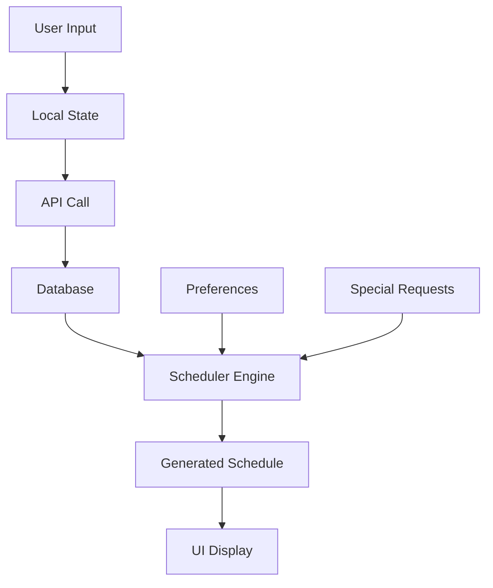

# UI 데이터 흐름 분석 보고서

## 📊 분석 요약

### 1. 주요 발견사항

#### ✅ 잘 작동하는 부분
- **스케줄러 타입 시스템**: `/lib/scheduler/types.ts`에 정의된 인터페이스들이 체계적으로 구성됨
- **컴포넌트 Props 전달**: 대부분의 컴포넌트가 타입 안전하게 props를 전달받음
- **새로운 선호도 시스템**: `ComprehensivePreferences`와 `SpecialRequest`가 잘 설계됨

#### ⚠️ 데이터 불일치 문제

**1. 중복된 Employee 인터페이스**
```typescript
// 3개의 서로 다른 Employee 정의 발견:
- /lib/scheduler/types.ts: Employee (표준)
- /lib/mock/team-members.ts: MockTeamMember (목업)
- /components/team/MyPreferencesPanel.tsx: ComprehensivePreferences (확장)
```

**2. 선호도 시스템 분리**
```typescript
// 기존 시스템
EmployeePreferences {
  preferredShifts: ShiftType[];
  avoidShifts: ShiftType[];
  preferredDaysOff: number[];
  maxConsecutiveDays: number;
  preferNightShift: boolean;
}

// 새로운 확장 시스템 (연동 안됨)
ComprehensivePreferences {
  workPreferences: {...}
  personalCircumstances: {...}
  healthConsiderations: {...}
  // ... 훨씬 더 상세함
}
```

#### 🗑️ 미사용 필드 발견

**1. `/lib/scheduler/types.ts`**
- `Shift.breakMinutes` - UI에서 사용 안됨
- `Schedule.approvedBy` - 승인 시스템 미구현
- `Schedule.publishedAt` - 발행 기능 미구현
- `ValidationError/ValidationWarning` - 중복 정의 (3곳)

**2. `/lib/mock/team-members.ts`**
- `avatar` - 프로필 이미지 표시 안함
- `minHoursPerWeek` - 최소 시간 체크 안함

**3. 데이터베이스 스키마와 UI 불일치**
- DB에는 `minStaff`, `maxStaff` 있지만 UI 미사용
- DB의 `breakMinutes` UI에서 설정 불가

---

## 🔄 데이터 흐름 매핑

### 1. 스케줄 생성 흐름
```
사용자 입력 (ScheduleConfigPanel)
    ↓
MockTeamMember[] → Employee[] 변환 ❌ (불완전)
    ↓
Scheduler 엔진 (로컬 실행만)
    ↓
ScheduleAssignment[] 생성
    ↓
UI 표시 (ScheduleBoard)
```

**문제점**:
- `ComprehensivePreferences`가 스케줄러에 전달 안됨
- `MockTeamMember`와 `Employee` 타입 불일치

### 2. 선호도 입력 흐름
```
MyPreferencesPanel (ComprehensivePreferences)
    ↓
handleSavePreferences()
    ↓
console.log() ⚠️ (저장만, 활용 안됨)
```

**문제점**:
- API 연동 없음
- 스케줄러가 새 선호도 시스템 인식 못함

### 3. 특별 요청 흐름
```
SpecialRequestModal
    ↓
로컬 상태 저장
    ↓
UI 카운트 표시만 ⚠️
```

**문제점**:
- 스케줄 생성 시 반영 안됨
- 관리자 승인 프로세스 없음

---

## 🔧 개선 권고사항

### Priority 1: 데이터 모델 통합

#### 1.1 Employee 인터페이스 통합
```typescript
// /lib/types/unified-employee.ts (신규)
export interface UnifiedEmployee extends Employee {
  // 기본 정보 (Employee)
  id: string;
  name: string;

  // 확장 정보 (ComprehensivePreferences 통합)
  comprehensivePreferences?: ComprehensivePreferences;

  // UI 표시용
  avatar?: string;
  phone: string;
  email: string;
}
```

#### 1.2 Adapter 패턴 구현
```typescript
// /lib/adapters/employee-adapter.ts
export class EmployeeAdapter {
  static fromMockToScheduler(
    mock: MockTeamMember,
    preferences?: ComprehensivePreferences
  ): Employee {
    return {
      id: mock.id,
      preferences: this.convertPreferences(preferences),
      // ... 매핑 로직
    };
  }

  static convertPreferences(
    comprehensive: ComprehensivePreferences
  ): EmployeePreferences {
    return {
      preferredShifts: comprehensive.workPreferences.preferredShifts,
      maxConsecutiveDays: comprehensive.workPreferences.maxConsecutiveDays,
      // ... 변환 로직
    };
  }
}
```

### Priority 2: 미사용 필드 정리

#### 2.1 제거 대상
- `Shift.breakMinutes` → UI 추가 또는 제거
- 중복된 `ValidationResult` 정의 → 통합
- `avatar` 필드 → 실제 사용 또는 제거

#### 2.2 구현 필요
- `Schedule.publishedAt` → 발행 기능 구현
- `Schedule.approvedBy` → 승인 워크플로우 구현

### Priority 3: API 연동

#### 3.1 선호도 저장 API
```typescript
// /app/api/preferences/route.ts
export async function POST(request: Request) {
  const preferences = await request.json();

  // DB 저장
  await savePreferences(preferences);

  // 스케줄러 캐시 무효화
  invalidateSchedulerCache(preferences.employeeId);

  return Response.json({ success: true });
}
```

#### 3.2 스케줄 생성 시 선호도 반영
```typescript
// /app/schedule/page.tsx 수정
const handleGenerateSchedule = async () => {
  // 선호도 가져오기
  const preferences = await fetchAllPreferences();

  // Employee 변환 시 선호도 포함
  const employees = members.map(m =>
    EmployeeAdapter.fromMockToScheduler(m, preferences[m.id])
  );

  // 스케줄 생성
  const result = await scheduler.createSchedule({
    employees,
    // ...
  });
};
```

### Priority 4: 타입 안정성 강화

#### 4.1 Zod 스키마 추가
```typescript
// /lib/validation/schemas.ts
import { z } from 'zod';

export const ComprehensivePreferencesSchema = z.object({
  workPreferences: z.object({
    preferredShifts: z.array(z.enum(['day', 'evening', 'night'])),
    // ... 전체 스키마 정의
  }),
  // ...
});

// 런타임 검증
export function validatePreferences(data: unknown) {
  return ComprehensivePreferencesSchema.parse(data);
}
```

### Priority 5: 데이터 흐름 문서화

#### 5.1 상태 관리 다이어그램


---

## 📋 체크리스트

### 즉시 수정 필요
- [ ] `MockTeamMember`와 `Employee` 타입 통합
- [ ] `ComprehensivePreferences` 스케줄러 연동
- [ ] 중복 `ValidationResult` 정의 제거
- [ ] 미사용 필드 정리

### 단계적 개선
- [ ] API 엔드포인트 구현
- [ ] 데이터 어댑터 레이어 추가
- [ ] 타입 검증 강화
- [ ] 상태 관리 중앙화
- [ ] 에러 핸들링 개선

### 장기 과제
- [ ] GraphQL 또는 tRPC 도입 검토
- [ ] 실시간 동기화 구현
- [ ] 캐싱 전략 수립
- [ ] 성능 최적화

---

## 🎯 결론

현재 UI 컴포넌트들은 잘 설계되어 있지만, **데이터 모델 간 연결이 느슨**하여 실제 데이터가 제대로 흐르지 않고 있습니다.

특히 새로 추가한 `ComprehensivePreferences`와 `SpecialRequest` 시스템이 스케줄링 엔진과 연동되지 않아, 사용자가 입력한 상세 정보가 실제 스케줄 생성에 반영되지 않는 것이 가장 큰 문제입니다.

**우선순위**:
1. 데이터 모델 통합 (1주)
2. API 연동 (3-4일)
3. 미사용 코드 정리 (1-2일)

이 작업을 완료하면 UI와 백엔드가 유기적으로 연결되어 실제 production-ready 상태가 될 것입니다.