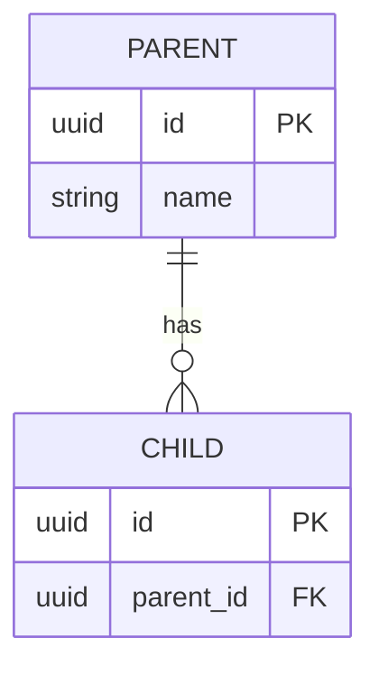

# Database Documentation

ShiftEasy 데이터베이스 스키마 문서화 및 관리 가이드

## 📁 파일 구조

```
docs/database/
├── README.md          # 이 파일 - 워크플로우 가이드
└── SCHEMA.md          # 데이터베이스 스키마 상세 문서
```

## 📖 문서 개요

### SCHEMA.md
전체 데이터베이스 스키마에 대한 포괄적인 문서입니다:
- 테이블 정의 및 컬럼 상세
- JSONB 구조 예시
- ER 다이어그램
- 멀티 테넌트 격리 패턴
- 인덱스 전략
- 변경 이력

## 🔄 스키마 변경 워크플로우

### 1. 스키마 수정 시
새로운 테이블을 추가하거나 기존 스키마를 수정할 때:

```bash
# 1. 스키마 파일 수정
src/db/schema/[your-schema].ts

# 2. 마이그레이션 생성
npm run db:generate

# 3. 마이그레이션 적용
npm run db:migrate

# 4. 테이블 상태 확인
npx tsx src/db/seed/check-all-tables.ts
```

### 2. 문서 업데이트
스키마를 변경한 후에는 문서를 업데이트해야 합니다:

**자동 업데이트 (권장):**
```bash
# Claude Code에서 database-schema-manager 스킬 실행
/skill database-schema-manager
```

**수동 업데이트:**
1. `SCHEMA.md`에서 해당 테이블 섹션 찾기
2. 테이블 정의 업데이트
3. JSONB 구조 예시 업데이트 (필요시)
4. ER 다이어그램 업데이트 (관계 변경 시)
5. Change Log에 항목 추가

### 3. 문서화 체크리스트

새 테이블 추가 시:
- [ ] SQL CREATE TABLE 정의 추가
- [ ] 컬럼 설명 작성
- [ ] JSONB 컬럼이 있다면 구조 예시 추가
- [ ] ER 다이어그램에 관계 추가
- [ ] 인덱스 정보 추가
- [ ] Change Log 항목 추가
- [ ] 테이블 통계 업데이트

기존 테이블 수정 시:
- [ ] 변경된 컬럼 정의 업데이트
- [ ] JSONB 구조 예시 업데이트 (해당시)
- [ ] ER 다이어그램 업데이트 (관계 변경시)
- [ ] Change Log 항목 추가
- [ ] Migration 정보 추가

## 🛠️ 유용한 명령어

### 데이터베이스 상태 확인
```bash
# 모든 테이블과 행 수 확인
npx tsx src/db/seed/check-all-tables.ts

# 특정 테이블 확인
npx drizzle-kit studio
```

### 스키마 관리
```bash
# 마이그레이션 생성
npm run db:generate

# 마이그레이션 적용
npm run db:migrate

# 마이그레이션 되돌리기
npm run db:rollback

# Drizzle Studio 실행 (GUI)
npm run db:studio
```

### 문서 검증
```bash
# 스키마 파일 린트 체크
npm run lint

# TypeScript 타입 체크
npm run type-check
```

## 📋 문서화 가이드라인

### 테이블 설명 작성 시
1. **명확성**: 테이블의 목적과 용도를 명확히 설명
2. **관계성**: 다른 테이블과의 관계 명시
3. **제약사항**: 비즈니스 규칙이나 제약사항 문서화
4. **예시**: 복잡한 JSONB 구조는 실제 예시 제공

### JSONB 구조 문서화
```typescript
// 좋은 예시
interface UserProfile {
  avatar?: string;           // 프로필 이미지 URL
  bio?: string;              // 자기소개 (최대 500자)
  preferences: {
    theme: 'light' | 'dark'; // UI 테마 설정
    language: string;        // 선호 언어 (ISO 639-1)
  };
}

// 나쁜 예시
interface UserProfile {
  data: any;  // 구조 불명확
}
```

### ER 다이어그램 업데이트
Mermaid 문법 사용:


## 🔍 문제 해결

### 문서와 실제 스키마가 다를 때
```bash
# 1. 현재 데이터베이스 스키마 확인
npx drizzle-kit introspect

# 2. 스키마 파일과 비교
# src/db/schema/*.ts 파일들 확인

# 3. 문서 업데이트 또는 스키마 수정
```

### 마이그레이션 충돌 시
```bash
# 1. 현재 마이그레이션 상태 확인
npx drizzle-kit check

# 2. 필요시 마이그레이션 재생성
npm run db:generate

# 3. 문서의 Change Log 업데이트
```

## 🎯 베스트 프랙티스

### 1. 스키마 변경 전
- [ ] 변경 영향도 분석
- [ ] 백업 계획 수립
- [ ] 마이그레이션 전략 수립

### 2. 스키마 변경 중
- [ ] 단계별 마이그레이션 작성
- [ ] 롤백 가능한 변경 설계
- [ ] 테스트 환경에서 먼저 검증

### 3. 스키마 변경 후
- [ ] 문서 즉시 업데이트
- [ ] 변경 사항 팀에 공유
- [ ] Change Log 작성

## 📚 추가 리소스

- [Drizzle ORM 문서](https://orm.drizzle.team/)
- [PostgreSQL 문서](https://www.postgresql.org/docs/)
- [멀티 테넌트 아키텍처 가이드](../architecture/MULTI_TENANT.md)

## 🤝 기여하기

문서 개선 제안이나 오류 발견 시:
1. 이슈 생성 또는 PR 제출
2. 명확한 설명과 예시 포함
3. 관련 스키마 파일 참조

---

**마지막 업데이트**: 2025-01-08
**관리자**: ShiftEasy Development Team
