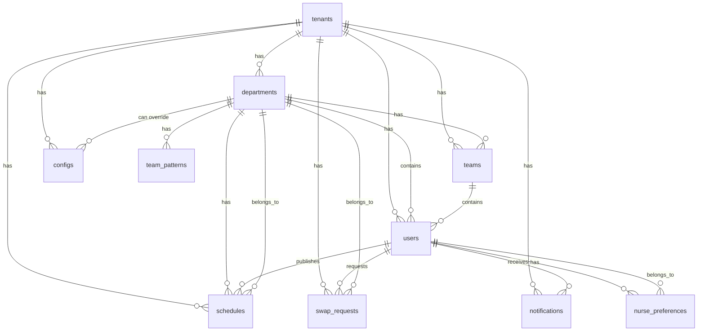

# ShiftEasy Database Schema Documentation

**Last Updated**: 2025-01-08

## Overview

ShiftEasy는 의료, 제조, 서비스 산업을 위한 근무 스케줄 관리 시스템입니다. 이 문서는 PostgreSQL 데이터베이스 스키마를 상세히 설명합니다.

## Database Statistics

- **총 테이블 수**: 12개 (활성)
- **빈 테이블**: 0개
- **총 데이터 행**: 608행

## Table Summary

| Table | Rows | Purpose |
|-------|------|---------|
| notifications | 191 | 사용자 알림 |
| audit_log | 179 | 감사 로그 |
| users | 75 | 사용자 계정 |
| holidays | 29 | 법정 공휴일 |
| nurse_preferences | 29 | 직원 선호사항 |
| departments | 22 | 부서 정보 |
| schedules | 20 | 근무 스케줄 |
| teams | 6 | 팀 정보 |
| swap_requests | 6 | 교대 요청 |
| tenants | 4 | 테넌트 조직 |
| team_patterns | 2 | 팀 근무 패턴 |
| configs | 0 | 조직 설정 (tenant/department별) |

---

## Core Tables

### tenants
**목적**: Multi-tenant 조직 정보 관리

**행 수**: 4

```sql
CREATE TABLE "tenants" (
  "id" uuid PRIMARY KEY DEFAULT gen_random_uuid(),
  "name" text NOT NULL,
  "slug" text UNIQUE NOT NULL,
  "secret_code" text UNIQUE NOT NULL,
  "plan" text NOT NULL DEFAULT 'guest',  -- guest, professional, enterprise
  "settings" jsonb DEFAULT '{"timezone":"Asia/Seoul","locale":"ko","maxUsers":30,"maxDepartments":3,"features":[],"signupEnabled":true}',
  "created_at" timestamptz NOT NULL DEFAULT now(),
  "updated_at" timestamptz NOT NULL DEFAULT now(),
  "deleted_at" timestamptz
);
```

**Indexes**:
- `tenants_slug_idx` on (slug)
- `tenants_secret_code_idx` on (secret_code)

**Settings JSONB Structure**:
```typescript
{
  timezone?: string;          // 기본: "Asia/Seoul"
  locale?: string;            // 기본: "ko"
  maxUsers?: number;          // 기본: 30 (Guest), 50 (Professional)
  maxDepartments?: number;    // 기본: 3
  features?: string[];        // 활성화된 기능 목록
  signupEnabled?: boolean;    // 가입 활성화 여부
}
```

---

### departments
**목적**: 부서/병동 정보

**행 수**: 22

```sql
CREATE TABLE "departments" (
  "id" uuid PRIMARY KEY DEFAULT gen_random_uuid(),
  "tenant_id" uuid NOT NULL REFERENCES "tenants"("id") ON DELETE CASCADE,
  "name" text NOT NULL,
  "code" text,
  "secret_code" text UNIQUE,
  "description" text,
  "settings" jsonb,
  "created_at" timestamptz NOT NULL DEFAULT now(),
  "updated_at" timestamptz NOT NULL DEFAULT now(),
  "deleted_at" timestamptz
);
```

**Indexes**:
- `departments_tenant_id_idx` on (tenant_id)
- `departments_secret_code_idx` on (secret_code)

**Foreign Keys**:
- `tenant_id` → tenants(id) ON DELETE CASCADE

---

### users
**목적**: 사용자 계정 및 프로필

**행 수**: 75

```sql
CREATE TABLE "users" (
  "id" uuid PRIMARY KEY DEFAULT gen_random_uuid(),
  "tenant_id" uuid NOT NULL REFERENCES "tenants"("id") ON DELETE CASCADE,
  "department_id" uuid REFERENCES "departments"("id") ON DELETE SET NULL,
  "team_id" uuid REFERENCES "teams"("id") ON DELETE SET NULL,
  "auth_user_id" text UNIQUE,
  "email" text NOT NULL,
  "name" text NOT NULL,
  "role" text NOT NULL DEFAULT 'member',  -- owner, admin, manager, member
  "employee_id" text,
  "position" text,
  "profile" jsonb,
  "status" text NOT NULL DEFAULT 'active',  -- active, inactive, on_leave
  "created_at" timestamptz NOT NULL DEFAULT now(),
  "updated_at" timestamptz NOT NULL DEFAULT now(),
  "deleted_at" timestamptz
);
```

**Indexes**:
- `users_tenant_id_idx` on (tenant_id)
- `users_email_idx` on (email)
- `users_auth_user_id_idx` on (auth_user_id)
- `users_department_id_idx` on (department_id)
- `users_team_id_idx` on (team_id)

**Profile JSONB Structure**:
```typescript
{
  phone?: string;
  avatar?: string;
  skills?: string[];
  certifications?: string[];
  preferences?: {
    preferredShifts?: string[];
    unavailableDates?: string[];
    maxHoursPerWeek?: number;
    minHoursPerWeek?: number;
  };
}
```

---

### schedules
**목적**: 근무 스케줄 관리

**행 수**: 20

```sql
CREATE TABLE "schedules" (
  "id" uuid PRIMARY KEY DEFAULT gen_random_uuid(),
  "tenant_id" uuid NOT NULL REFERENCES "tenants"("id") ON DELETE CASCADE,
  "department_id" uuid NOT NULL REFERENCES "departments"("id") ON DELETE CASCADE,
  "start_date" timestamptz NOT NULL,
  "end_date" timestamptz NOT NULL,
  "status" text NOT NULL DEFAULT 'draft',  -- draft, published, archived
  "version" integer NOT NULL DEFAULT 1,
  "published_at" timestamptz,
  "published_by" uuid REFERENCES "users"("id"),
  "deleted_flag" text,  -- 'X' for soft deleted
  "metadata" jsonb,
  "created_at" timestamptz NOT NULL DEFAULT now(),
  "updated_at" timestamptz NOT NULL DEFAULT now()
);
```

**Indexes**:
- `schedules_tenant_id_idx` on (tenant_id)
- `schedules_department_id_idx` on (department_id)
- `schedules_date_range_idx` on (start_date, end_date)
- `schedules_status_idx` on (status)
- `schedules_deleted_flag_idx` on (deleted_flag)
- `schedules_version_idx` on (version)

**Metadata JSONB Structure**:
```typescript
{
  notes?: string;
  constraints?: any;
  stats?: {
    totalShifts?: number;
    averageHours?: number;
    coverage?: Record<string, number>;
  };
  confirmedAt?: string;
  confirmedBy?: string;
  approverNotes?: string;
  validationScore?: number;
  assignments?: any;  // 실제 근무 배정 데이터
  versionHistory?: Array<{
    version: number;
    updatedAt: string;
    updatedBy: string;
    reason: string;
    changes?: any;
  }>;
}
```

---

### notifications
**목적**: 사용자 알림 시스템

**행 수**: 191

```sql
CREATE TABLE "notifications" (
  "id" uuid PRIMARY KEY DEFAULT gen_random_uuid(),
  "tenant_id" uuid NOT NULL REFERENCES "tenants"("id") ON DELETE CASCADE,
  "department_id" uuid REFERENCES "departments"("id") ON DELETE CASCADE,
  "user_id" uuid REFERENCES "users"("id") ON DELETE CASCADE,
  "type" text NOT NULL DEFAULT 'general',
  "priority" text NOT NULL DEFAULT 'medium',  -- low, medium, high, urgent
  "title" text NOT NULL,
  "message" text NOT NULL,
  "topic" text,
  "action_url" text,
  "data" jsonb,
  "actions" jsonb,
  "read_at" timestamptz,
  "delivered_at" timestamptz,
  "created_at" timestamptz NOT NULL DEFAULT now(),
  "updated_at" timestamptz NOT NULL DEFAULT now()
);
```

**Notification Types**:
- schedule_published
- schedule_updated
- swap_requested
- swap_approved
- swap_rejected
- emergency_call
- shift_reminder
- general

**Indexes**:
- `notifications_tenant_id_idx` on (tenant_id)
- `notifications_department_id_idx` on (department_id)
- `notifications_user_id_idx` on (user_id)
- `notifications_type_idx` on (type)
- `notifications_priority_idx` on (priority)
- `notifications_read_at_idx` on (read_at)
- `notifications_topic_idx` on (topic)
- `notifications_created_at_idx` on (created_at)

---

### swap_requests
**목적**: 근무 교대 요청 관리

**행 수**: 6

```sql
CREATE TABLE "swap_requests" (
  "id" uuid PRIMARY KEY DEFAULT gen_random_uuid(),
  "tenant_id" uuid NOT NULL REFERENCES "tenants"("id") ON DELETE CASCADE,
  "department_id" uuid NOT NULL REFERENCES "departments"("id") ON DELETE CASCADE,
  "requester_id" uuid NOT NULL REFERENCES "users"("id") ON DELETE CASCADE,
  "target_user_id" uuid REFERENCES "users"("id") ON DELETE CASCADE,
  "original_shift_id" text,
  "target_shift_id" text,
  "date" timestamptz NOT NULL,
  "status" text NOT NULL DEFAULT 'pending',  -- pending, approved, rejected, cancelled
  "reason" text,
  "approved_by" uuid REFERENCES "users"("id") ON DELETE SET NULL,
  "approved_at" timestamptz,
  "approval_notes" text,
  "created_at" timestamptz NOT NULL DEFAULT now(),
  "updated_at" timestamptz NOT NULL DEFAULT now()
);
```

**Indexes**:
- `swap_requests_tenant_id_idx` on (tenant_id)
- `swap_requests_department_id_idx` on (department_id)
- `swap_requests_requester_id_idx` on (requester_id)
- `swap_requests_target_user_id_idx` on (target_user_id)
- `swap_requests_status_idx` on (status)
- `swap_requests_date_idx` on (date)

---

## Configuration Tables

### configs
**목적**: 조직 설정 마스터 데이터 (Tenant 및 Department별 설정)

**행 수**: 0 (마이그레이션 후)

```sql
CREATE TABLE "configs" (
  "id" uuid PRIMARY KEY DEFAULT gen_random_uuid(),
  "tenant_id" uuid NOT NULL REFERENCES "tenants"("id") ON DELETE CASCADE,
  "department_id" uuid REFERENCES "departments"("id") ON DELETE CASCADE,
  "config_key" text NOT NULL,
  "config_value" jsonb NOT NULL,
  "created_at" timestamptz NOT NULL DEFAULT now(),
  "updated_at" timestamptz NOT NULL DEFAULT now()
);
```

**Unique Constraint**: (tenant_id, department_id, config_key)

**Department-Level Override**:
- `department_id`가 NULL: 테넌트 전체 기본 설정
- `department_id`가 있음: 해당 부서의 설정 (기본 설정 오버라이드)
- 조회 시 부서별 설정이 우선, 없으면 테넌트 기본 설정 사용

**Config Keys**:
- `shift_types`: 근무 타입 정의 (부서별로 다를 수 있음)
- `positions`: 직위 목록 (부서별로 다를 수 있음)
- `departments`: 부서 설정 (tenant 레벨)
- `contract_types`: 계약 형태
- `position_groups`: 직위 그룹
- `employee_statuses`: 직원 상태
- `schedule_rules`: 스케줄 생성 규칙 (부서별)
- `shift_rules`: 근무 규칙 (부서별)
- `performance_thresholds`: 성능 임계값
- `staff_experience_weights`: 경력 가중치
- `team_balance_rules`: 팀 밸런스 규칙 (부서별)
- `balance_weights`: 밸런스 계산 가중치
- `staff_default_values`: 직원 기본값

**Shift Types Config Example**:
```json
[
  {
    "code": "D",
    "name": "주간",
    "startTime": "08:00",
    "endTime": "16:00",
    "color": "#3B82F6"
  },
  {
    "code": "E",
    "name": "저녁",
    "startTime": "16:00",
    "endTime": "00:00",
    "color": "#F59E0B"
  },
  {
    "code": "N",
    "name": "야간",
    "startTime": "00:00",
    "endTime": "08:00",
    "color": "#8B5CF6"
  },
  {
    "code": "O",
    "name": "OFF",
    "startTime": "00:00",
    "endTime": "00:00",
    "color": "#E5E7EB"
  }
]
```

---

### holidays
**목적**: 법정 공휴일 관리

**행 수**: 29

```sql
CREATE TABLE "holidays" (
  "id" uuid PRIMARY KEY DEFAULT gen_random_uuid(),
  "tenant_id" uuid,  -- NULL means global holiday
  "date" date NOT NULL,
  "name" text NOT NULL,
  "is_recurring" boolean DEFAULT false,
  "created_at" timestamptz NOT NULL DEFAULT now(),
  "updated_at" timestamptz NOT NULL DEFAULT now()
);
```

**Indexes**:
- `holidays_tenant_idx` on (tenant_id)
- `holidays_date_idx` on (date)
- `holidays_tenant_date_idx` on (tenant_id, date)

**Notes**:
- `tenant_id`가 NULL인 경우 모든 테넌트에 적용되는 전역 공휴일
- `is_recurring`이 true인 경우 매년 반복되는 공휴일

---

### teams
**목적**: 팀 관리

**행 수**: 6

```sql
CREATE TABLE "teams" (
  "id" uuid PRIMARY KEY DEFAULT gen_random_uuid(),
  "tenant_id" uuid NOT NULL REFERENCES "tenants"("id") ON DELETE CASCADE,
  "department_id" uuid REFERENCES "departments"("id") ON DELETE CASCADE,
  "name" text NOT NULL,
  "code" text NOT NULL,
  "color" text NOT NULL DEFAULT '#3B82F6',
  "display_order" integer NOT NULL DEFAULT 0,
  "is_active" text NOT NULL DEFAULT 'true',
  "created_at" timestamptz NOT NULL DEFAULT now(),
  "updated_at" timestamptz NOT NULL DEFAULT now(),
  "deleted_at" timestamptz
);
```

**Indexes**:
- `teams_tenant_id_idx` on (tenant_id)
- `teams_department_id_idx` on (department_id)
- `teams_code_idx` on (code)

---

### team_patterns
**목적**: 팀별 근무 패턴 설정

**행 수**: 2

```sql
CREATE TABLE "team_patterns" (
  "id" uuid PRIMARY KEY DEFAULT gen_random_uuid(),
  "department_id" uuid NOT NULL REFERENCES "departments"("id") ON DELETE CASCADE,
  "required_staff_day" integer NOT NULL DEFAULT 5,
  "required_staff_evening" integer NOT NULL DEFAULT 4,
  "required_staff_night" integer NOT NULL DEFAULT 3,
  "default_patterns" jsonb NOT NULL DEFAULT '[["D","D","D","OFF","OFF"]]',
  "avoid_patterns" jsonb DEFAULT '[]',
  "total_members" integer NOT NULL DEFAULT 15,
  "is_active" text NOT NULL DEFAULT 'true',
  "created_at" timestamptz NOT NULL DEFAULT now(),
  "updated_at" timestamptz NOT NULL DEFAULT now()
);
```

**Indexes**:
- `team_patterns_department_idx` on (department_id)
- `team_patterns_active_idx` on (is_active)

**Default Patterns Example**:
```json
[
  ["D", "D", "D", "OFF", "OFF"],
  ["N", "N", "OFF", "OFF", "E", "E"]
]
```

**Avoid Patterns Example**:
```json
[
  ["N", "N", "D"],  // 야간 2일 후 바로 주간 근무 피하기
  ["E", "N"]        // 저녁 후 바로 야간 근무 피하기
]
```

---

## Preference Tables

### nurse_preferences
**목적**: 직원 근무 선호사항 및 제약사항 (간소화됨)

**행 수**: 29

**업데이트**: 2025-11-09 - 불필요한 칼럼 제거, 필수 필드만 유지

```sql
CREATE TABLE "nurse_preferences" (
  "id" uuid PRIMARY KEY DEFAULT gen_random_uuid(),
  "tenant_id" uuid NOT NULL,
  "nurse_id" uuid NOT NULL REFERENCES "users"("id"),
  "department_id" uuid,

  -- Shift preferences (근무 선호도)
  "work_pattern_type" text DEFAULT 'three-shift',  -- 'three-shift', 'night-intensive', 'weekday-only'
  "preferred_patterns" jsonb,  -- 선호 근무 패턴 배열
  "avoid_patterns" jsonb,  -- 기피 근무 패턴 배열 (개인)

  -- Off-balance system (잔여 OFF 관리)
  "accumulated_off_days" integer DEFAULT 0,  -- 누적된 잔여 OFF 일수
  "allocated_to_accumulation" integer DEFAULT 0,  -- 향후 사용을 위해 저축된 일수
  "allocated_to_allowance" integer DEFAULT 0,  -- 수당으로 지급할 일수

  "created_at" timestamptz NOT NULL DEFAULT now(),
  "updated_at" timestamptz NOT NULL DEFAULT now()
);
```

**Validation**: `allocated_to_accumulation + allocated_to_allowance <= accumulated_off_days`

**Indexes**:
- `nurse_preferences_nurse_idx` on (nurse_id)
- `nurse_preferences_tenant_idx` on (tenant_id)
- `nurse_preferences_department_idx` on (department_id)

**Preferred Patterns Example**:
```json
[
  {
    "pattern": "DD-EE-NN-OFF",
    "preference": 10
  },
  {
    "pattern": "D-D-E-E-N-N-OFF-OFF",
    "preference": 8
  }
]
```

**Avoid Patterns Example**:
```json
[
  ["N", "D"],  // 야간 후 주간 기피
  ["E", "N", "D"]  // 저녁-야간-주간 연속 기피
]
```

---

## System Tables

### audit_log
**목적**: 시스템 감사 로그

**행 수**: 179

```sql
CREATE TABLE "audit_log" (
  "id" uuid PRIMARY KEY DEFAULT gen_random_uuid(),
  "tenant_id" text,
  "actor_id" text,
  "action" text NOT NULL,
  "entity_type" text NOT NULL,
  "entity_id" text NOT NULL,
  "before" jsonb,
  "after" jsonb,
  "metadata" jsonb,
  "created_at" timestamptz NOT NULL DEFAULT now()
);
```

**Indexes**:
- `audit_log_tenant_id_idx` on (tenant_id)
- `audit_log_actor_id_idx` on (actor_id)
- `audit_log_entity_idx` on (entity_type, entity_id)
- `audit_log_created_at_idx` on (created_at)

**Action Examples**:
- `CREATE_SCHEDULE`
- `MODIFY_ASSIGNMENT`
- `PUBLISH_SCHEDULE`
- `APPROVE_SWAP`
- `UPDATE_PREFERENCES`

---

## Entity Relationship Diagram



---

## Multi-Tenant Isolation

모든 주요 테이블은 `tenant_id`를 포함하여 테넌트 격리를 보장합니다:

1. **tenants**: 최상위 조직
2. **departments**: tenant별 부서
3. **users**: tenant별 사용자
4. **schedules**: tenant별 스케줄
5. **notifications**: tenant별 알림
6. **swap_requests**: tenant별 교대 요청
7. **teams**: tenant별 팀
8. **nurse_preferences**: tenant별 선호사항
9. **configs**: tenant별 설정 (부서별 오버라이드 가능)

**Soft Delete 패턴**: `deleted_at` 컬럼 또는 `deleted_flag` 사용

---

## Indexes Strategy

### Performance Indexes
- **Foreign Keys**: 모든 외래 키에 인덱스 생성
- **Lookup Columns**: email, code, slug 등 조회 컬럼
- **Date Ranges**: start_date, end_date 조합 인덱스
- **Status Fields**: 상태 필터링을 위한 인덱스

### Composite Indexes
- `schedules_date_range_idx`: (start_date, end_date)
- `holidays_tenant_date_idx`: (tenant_id, date)
- `configs`: UNIQUE (tenant_id, department_id, config_key)

---

## JSONB Columns

JSONB를 사용하는 주요 컬럼들:

| Table | Column | Purpose |
|-------|--------|---------|
| tenants | settings | 테넌트 설정 |
| users | profile | 사용자 프로필 정보 |
| schedules | metadata | 스케줄 메타데이터 및 배정 |
| notifications | data, actions | 알림 데이터 및 액션 |
| tenant_configs | config_value | 설정 값 |
| nurse_preferences | 다수 | 선호사항 세부 정보 |
| team_patterns | default_patterns, avoid_patterns | 패턴 정의 |

---

## Change Log

### 2025-01-08 (v2)
- **BREAKING CHANGE**: `tenant_configs` 테이블 → `configs` 테이블로 변경
- `configs` 테이블에 `department_id` 컬럼 추가
  - NULL: 테넌트 전체 기본 설정
  - 값 있음: 부서별 설정 오버라이드
- Unique constraint 변경: (tenant_id, config_key) → (tenant_id, department_id, config_key)
- 부서별 shift_types, positions 등 독립 설정 지원
- API 라우터 department_id 지원 추가
- Helper 함수들 department별 설정 조회 지원
- 모든 기존 데이터 삭제 (마이그레이션 필요)

### 2025-01-08 (v1)
- 초기 스키마 문서 생성
- 12개 활성 테이블 문서화
- 총 608 rows 데이터 확인
- ER 다이어그램 추가
- JSONB 구조 상세 설명 추가

---

## Migration History

현재까지 실행된 마이그레이션:
- 기본 테넌트 구조 생성
- 사용자 및 부서 관리 추가
- 스케줄링 시스템 구축
- 알림 시스템 추가
- 팀 관리 기능 추가
- 선호사항 시스템 구축

---

## Best Practices

### Schema Design
- ✅ UUID를 primary key로 사용
- ✅ tenant_id로 multi-tenant 격리
- ✅ created_at, updated_at 타임스탬프
- ✅ Soft delete (deleted_at 또는 deleted_flag)
- ✅ 모든 외래 키에 인덱스
- ✅ JSONB로 유연한 데이터 구조

### Data Integrity
- ✅ CASCADE 삭제 규칙 적용
- ✅ NOT NULL 제약조건
- ✅ UNIQUE 제약조건
- ✅ 외래 키 관계 정의

### Performance
- ✅ 조회 패턴에 맞는 인덱스
- ✅ Composite 인덱스 활용
- ✅ JSONB 인덱스 (필요시)
